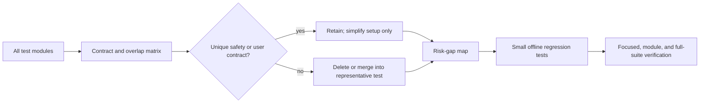

# refactor: Audit and harden the test suite

## Summary

Audit every `test_*.py` module under `tests/` (26 modules, about 230 test
functions/methods) to remove only tests that have no unique observable
contract, reduce unnecessary setup without weakening isolation, and add small
offline regression coverage for high-risk gaps. Work proceeds in reviewable
stages: inventory and decision record first, then simplification, then targeted
coverage additions and verification.

## Problem Frame

The suite contains important safety coverage for broker selection, runtime
fail-closed behavior, order calculations, portfolio sources, and API payload
handling. Its larger modules also repeat module-global setup and mock several
collaborators per test. Size or mock count alone does not establish redundancy:
an order, cancellation, fallback, or lifecycle test can need several seams to
assert a real safety contract. The audit must therefore preserve the one
representative test that proves each distinct externally observable behavior.

## Requirements

- **R1.** Review all `tests/**/test_*.py` files, including architecture, core,
  data, KIS, scheduler, strategy, Telegram, and Toss directories.
- **R2.** For every deletion, consolidation, or large setup reduction, record
  the protected contract, overlapping coverage, replacement (if any), and why
  no unique regression detection is lost.
- **R3.** Keep tests fully offline: no credentials, live KIS/Toss/Telegram/
  Sheets calls, or order-changing actions.
- **R4.** Prefer application-owned seams, small fakes, `tmp_path`, and
  parameterization over broad SDK/module replacement or manually cleaned fixed
  temporary directories.
- **R5.** Prioritize added coverage at trading-safety boundaries: invalid
  broker/API data, non-executable orders, ordering and idempotency, and runtime
  permission/failure transitions.
- **R6.** Do not modify `src/kis/kis_api/**`, alter production behavior, or
  turn coverage percentage or mutation score into the success criterion.

## Scope Boundaries

### In scope

- Existing-test contract inventory, consolidation, setup simplification, and
  targeted new regression tests.
- Offline fixtures and test-local fakes only when they materially replace
  duplicated setup or prove a missing risk boundary.

### Out of scope

- Live/paper brokerage integration, Telegram delivery, or automatic orders.
- Refactoring production architecture solely to make tests easier to write.
- Broad API endpoint coverage or a global coverage/mutation threshold.

### Deferred to Follow-Up Work

- Any production defect discovered by a new characterization test; document it
  separately and obtain scope for the production fix.
- Extended websocket reconnect/concurrency simulations if the initial inventory
  shows an actionable defect not covered by a deterministic unit seam.

## Key Technical Decisions

| Decision | Rationale |
| --- | --- |
| Decide duplication by unique failure mode, not test length, mock count, or coverage lines. | Several high-mock orchestration tests cover distinct fail-closed paths. |
| Produce a candidate matrix before deleting tests. | It makes every deletion reviewable and prevents accidental safety-coverage loss. |
| Retain architecture import-boundary subprocess checks unless their prohibition overlaps exactly. | Each current check protects a different import or side-effect boundary; subprocess cost is justified by that contract. |
| Replace structural negative assertions with behavior/boundary contracts. | Assertions such as absence of a private helper or removed public symbol freeze implementation without protecting a user or safety outcome. |
| Strengthen pure calculation and app-owned facade seams first. | They are deterministic, high consequence, and require no external SDK/network emulation. |

## High-Level Technical Design

## Implementation Units

### U1. Create the test-contract inventory and decision gate

**Goal:** Establish a complete, reviewable baseline before changing tests.

**Requirements:** R1, R2, R3, R5.

**Dependencies:** None.

**Files:**
- Create: `docs/testing/test-suite-audit.md`
- Inspect: every `tests/**/test_*.py` module
- Inspect: matching application-owned modules under `src/`

**Approach:** Build a matrix grouped by test module. Each row identifies the
test or parameter group, its observable contract/failure mode, external seams,
overlap candidate, proposed action (retain, simplify, merge, delete, add), and
the representative test left behind. Flag high-risk gaps separately. Treat
the following only as initial candidates, not pre-approved deletions:
structural assertions in `tests/core/test_system_state.py`,
`tests/strategy/test_strategy_workflows.py`, and
`tests/toss/test_api_helpers.py`; duplicated manual temporary-directory setup
in the Toss API suite; and properties that duplicate the production formula.

**Patterns to follow:** `tests/architecture/test_boundaries.py` for explicit
contracts and existing offline replay/property test conventions in
`tests/kis/test_kis_replay.py`, `tests/toss/test_toss_replay.py`, and
`tests/strategy/test_raoeo_properties.py`.

**Test scenarios:**
- Confirm every discovered `test_*.py` module has at least one matrix entry.
- For each deletion/merge candidate, state the exact surviving test that covers
  the same input, failure mode, and observable result—or mark it as not safe
  to remove.
- Record whether a test has a route to live credentials/network/order actions;
  any positive finding blocks later changes until isolated.

**Verification:** The inventory has no unclassified test module and provides a
clear approval list for U2/U3. Pause for user review of proposed deletions and
merges before applying them.

### U2. Consolidate structural tests and shrink repeated setup

**Goal:** Remove only approved low-value structural assertions and make
retained tests smaller, isolated, and intention-revealing.

**Requirements:** R2, R3, R4, R6.

**Dependencies:** U1 and approval of its candidate matrix.

**Files:**
- Modify as approved: `tests/core/test_system_state.py`
- Modify as approved: `tests/core/test_runtime.py`
- Modify as approved: `tests/strategy/test_strategy_workflows.py`
- Modify as approved: `tests/toss/test_api_helpers.py`
- Modify as approved: `tests/kis/test_broker.py`
- Modify as approved: `tests/data/test_portfolio.py`
- Modify as approved: `tests/architecture/test_boundaries.py`
- Update: `docs/testing/test-suite-audit.md`

**Approach:** Delete implementation-name assertions with no boundary contract;
merge exact duplicates through parameterization only when test diagnostics stay
clear; move repeated disabled-auth/payload construction into local helpers or
fixtures; and use `tmp_path` in place of fixed `tests/.tmp-*` directories in
both the Toss API and runtime credential tests.
Do not compress distinct KIS REST-disabled entry points, portfolio scope/cache
paths, or import-boundary subprocess contracts merely because they share setup.

**Test scenarios:**
- A retained KIS REST-disabled representative confirms each distinct blocked
  class of side effect (order, cancellation, data retrieval, worker auth).
- Toss credential/token tests use isolated temporary paths and pass under
  parallel-safe filesystem cleanup.
- Runtime credential tests use isolated temporary paths and retain their
  encrypted current-format and legacy-format parsing contracts.
- A merged parameter group reports which policy branch fails without masking
  its input or expected behavior.
- Remaining architecture checks still execute imports in isolated processes and
  assert their unique forbidden side effect.

**Verification:** Focused affected modules pass offline; the audit matrix
links every completed deletion/merge to its representative coverage.

### U3. Add small regression tests for confirmed risk gaps

**Goal:** Add behavior-focused coverage where the inventory shows a material
safety contract is untested, without broadening into endpoint-by-endpoint API
testing.

**Requirements:** R3, R4, R5, R6.

**Dependencies:** U1; U2 where a shared fake/fixture is introduced.

**Files:**
- Create as confirmed by U1: `tests/data/test_portfolio_scope.py`
- Create as confirmed by U1: `tests/toss/test_rate_limit.py`
- Create as confirmed by U1: `tests/strategy/test_rebalancing.py`
- Create as confirmed by U1: `tests/kis/test_event_handler.py`
- Modify only if needed: `tests/strategy/test_raoeo_properties.py`
- Modify only if needed: `tests/kis/test_broker.py`
- Modify only if needed: `tests/toss/test_query_helpers.py`
- Update: `docs/testing/test-suite-audit.md`

**Approach:** Select additions from the ranked risk-gap map, rather than adding
all candidates. Favor deterministic input/output tests for invalid scope alias,
malformed retry metadata, non-positive/invalid prices, buying-power limits,
and duplicate or out-of-order event handling. If property testing produces a
counterexample, preserve its minimized example as a normal regression test.

**Test scenarios:**
- Invalid or alias portfolio scopes produce the established safe normalization
  or validation result without fetching a broker.
- Rate-limit retry rejects malformed retry metadata, observes retry bounds, and
  keeps independent API groups isolated.
- Rebalancing never emits a non-positive quantity or a buy beyond the provided
  orderable cash under zero/missing price boundaries.
- Event-handler malformed, duplicate, or out-of-order payloads do not create a
  duplicate state/audit effect and fail safely.
- Any new fixture uses dummy/sanitized data and an existing injected seam; it
  never reaches DNS, credentials, or an order endpoint.

**Verification:** Each added test demonstrates a distinct failure mode recorded
in the matrix and passes independently without external configuration.

### U4. Verify the suite and document the maintainable baseline

**Goal:** Prove that consolidation preserved offline behavior and leave future
test authors with the decision record.

**Requirements:** R2, R3, R4, R5.

**Dependencies:** U2, U3.

**Files:**
- Update: `docs/testing/test-suite-audit.md`
- Review: `pyproject.toml`
- Review: `.github/workflows/ci.yml`

**Approach:** Run focused tests while making each change, then each affected
directory, the host suite, and the Docker test service. Compare coverage as
diagnostic information only; assess removals by the preserved contract matrix.
Record any test that is flaky, slow, or still overly coupled but was retained
because it protects a unique boundary.

**Test scenarios:**
- The full suite remains credential-free and does not start the trading runtime
  or submit an order.
- The Docker test service exercises the same offline suite successfully.
- Coverage reporting may change after deletion, but no deletion is accepted
  unless its unique observable contract remains covered.

**Verification:** Relevant focused tests, `venv/bin/pytest tests`, and
`docker compose run --rm test` pass; audit documentation records final actions,
deferred risks, and any characterization failures found.

## Risks and Mitigations

| Risk | Mitigation |
| --- | --- |
| Deleting a test that catches a rare trading-safety regression | Require a contract matrix and a surviving representative before removal; stop for review after U1. |
| Mistaking many mocks for redundant coverage | Evaluate the side effect and failure mode, not setup size. |
| New tests become covert network or credential tests | Use injected seams, sanitized fixtures, and offline-focused verification. |
| Coverage decreases after removing low-value tests | Treat coverage as diagnostic; judge by contract preservation and added risk coverage. |
| Property tests encode the same flawed formula as production | Assert independent invariants and retain minimized counterexamples as examples. |

## Sources and Research

- `AGENTS.md` — Docker-only runtime, offline testing expectations, vendor KIS
  boundary, and required verification.
- `docs/specs/2026-07-09-advanced-python-testing-design.md` —
  risk-focused offline testing, replay fixtures, property-test invariants, and
  no global coverage target.
- `docs/plans/2026-07-09-advanced-python-testing.md` — existing
  test-hardening direction already implemented in the repository.
- Static review of all current `tests/**/test_*.py` modules and their related
  application-owned sources; no test suite was run during planning.
