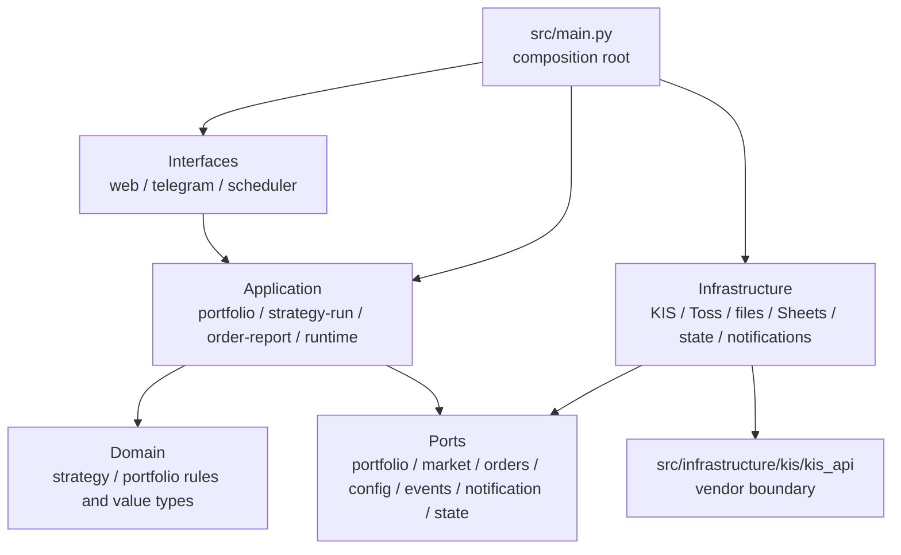

# Layered Trading Architecture - Plan

## Goal Capsule

- **Objective:** Reorganize the trading system so dependency direction is `interfaces -> application -> domain/ports <- infrastructure`, with `src/main.py` as the only composition root.
- **Behavioral authority:** Existing KIS/Toss trading behavior, fail-closed startup, Docker-only runtime, Telegram commands, dashboard endpoints, and private configuration locations take precedence over package movement convenience.
- **Stop conditions:** Do not change strategy algorithms, order policy, vendor endpoint-wrapper behavior, or live account state. Stop and resolve any characterization-test mismatch before migrating the affected flow.
- **Execution profile:** Incremental vertical migration with temporary compatibility re-exports; no big-bang directory move.

---

## Product Contract

### Summary

The current application has useful seams but package dependencies form cycles: interface modules call concrete services, application orchestration lives in `strategy` and `data`, and the KIS vendor tree imports application and interface modules.
This refactor establishes package ownership and one-way dependencies without changing trading behavior.

### Problem Frame

The current structure makes a feature change likely to cross unrelated packages and conceals runtime dependencies behind lazy imports.
The KIS vendor boundary is particularly fragile because app logging, display, state, and Telegram behavior have entered the former `src/kis/kis_api` tree.

### Requirements

- R1. The final application structure expresses these layers: `src/interfaces`, `src/application`, `src/domain`, `src/application/ports`, and `src/infrastructure`.
- R2. Interfaces (`web`, `telegram`, `scheduler`) invoke application use cases and own transport-specific request parsing, formatting, and scheduling only.
- R3. Application services own portfolio, strategy-run, order/report, and runtime use-case orchestration; they depend only on domain code and port contracts.
- R4. Domain code contains strategy and portfolio rules/value types and does not import interfaces, application services, concrete infrastructure, vendor APIs, configuration, or notification channels.
- R5. Infrastructure implements application ports for KIS, Toss, configuration/files, Google Sheets, state/cache, events, and notifications; it does not import interfaces or application use cases.
- R6. `src/infrastructure/kis/kis_api/**` is the vendor boundary and imports no application-owned `broker`, `core`, `data`, `state`, `telegram_bot`, or interface package. `src/kis/kis_api/**` is a compatibility-only import shim during migration.
- R7. `src/main.py` remains the sole composition root that creates concrete infrastructure, injects it into application services, and preserves the current fail-closed lifecycle order.
- R8. Existing public runtime behavior remains compatible throughout migration, using thin compatibility modules only until all callers and tests move to the new layers.
- R9. Architecture tests enforce import direction and import-time safety without relying on private symbol names or live credentials/network access.
- R10. Changed module documentation, `README.md`, and architecture documentation explain the final layer map and operational migration impact.

### Scope Boundaries

#### In scope

- Package introduction, relocation, compatibility re-exports, dependency inversion, and tests required to establish the target architecture.
- Migration of portfolio retrieval, strategy execution, runtime control, scheduler jobs, Telegram handlers, and web endpoints to application use cases.
- Removal of application/interface imports from the KIS vendor tree through app-owned adapters or callbacks.

#### Out of scope

- Changes to RAOEO, Value Averaging, rebalancing rules, broker-selection semantics, order-sizing policy, or dashboard/Telegram user-facing functionality.
- Rewriting the official KIS endpoint wrappers or changing their request/response contracts.
- Live KIS/Toss diagnostics, live orders, credential migration, or configuration-format changes.

#### Deferred to Follow-Up Work

- Separating backtest source from generated report/image artifacts.
- Replacing global queues, caches, and callbacks with a new concurrency framework after their behavior is characterized under the new layer boundaries.

### Acceptance Examples

- AE1. A Telegram strategy command and the scheduled strategy job invoke the same application strategy-run use case and receive equivalent result data before each interface formats or sends it.
- AE2. A dashboard portfolio request invokes the portfolio use case without importing broker modules from the web interface.
- AE3. Importing any domain package does not load KIS configuration, vendor APIs, Telegram, FastAPI, or external network clients.
- AE4. The KIS vendor package can be imported without importing an application-owned logging, display, state, or notification module.
- AE5. Startup still refuses to start the trading runtime when required Telegram, KIS, or Toss initialization fails.

---

## Planning Contract

### Key Technical Decisions

- KTD1. **Use a dependency-inversion migration, not a physical rename first.** Introduce application ports and services before moving callers, then relocate concrete implementations behind stable contracts. This keeps each migration slice testable and reversible.
- KTD2. **Keep `src/main.py` as the composition root.** It already owns lifecycle sequencing and is the appropriate single location to wire KIS/Toss/configuration/notification implementations into use cases.
- KTD3. **Preserve the KIS worker as an infrastructure serialization mechanism.** `PortfolioService` calls a `SerializedKisOperations` port implemented by the worker; the worker serializes only low-level KIS operations and never calls an application service.
- KTD4. **Treat reports as application result data, not Telegram output.** Application services return execution/portfolio results. Telegram, scheduler, and web adapters decide formatting, delivery, and transport response behavior.
- KTD5. **Use explicit ports for cross-cutting outputs.** Notification, display/event publication, runtime state, configuration, portfolio source, market data, order execution, and history persistence are application-facing contracts with infrastructure implementations.
- KTD6. **Keep compatibility modules thin and time-bounded.** A named compatibility register records each legacy module, owner, permitted external consumer, deprecation behavior, and removal milestone. Legacy modules may expose documented delegating wrappers while tests and scripts still patch their public seams, but they may not contain parallel business logic or new forbidden dependency paths. A versioned allowlist records each temporary legacy edge and shrinks to zero before removal; production code under `src/` may not use a registered legacy import at the final gate.
- KTD7. **Inject interface dependencies through factories.** Web app creation, Telegram handler registration, and scheduler job registration receive application use cases as constructor/factory inputs. `main.py` supplies those inputs; no interface imports `main.py` or constructs concrete adapters.
- KTD8. **Make mutating broker operations reconciliation-safe.** Order/cancel ports carry a correlation identifier and distinguish accepted, rejected, and ambiguous outcomes. An ambiguous timeout is reconciled by lookup, never blindly retried; history or notification failure never resubmits an order.
- KTD9. **Preserve security and observability boundaries as contracts.** The current authorization/deployment posture of control endpoints is characterized before migration. All adapters use bounded timeouts, TLS/host and header rules, redacted observability, and isolated best-effort notifications.

### High-Level Technical Design



### Target Package Map

```text
src/
  interfaces/
    web/
    telegram/
    scheduler/
  application/
    ports/
    portfolio_service.py
    strategy_run_service.py
    order_report_service.py
    runtime_service.py
  domain/
    strategy/
    portfolio/
  infrastructure/
    kis/
    toss/
    broker/
    config/
    gsheet/
    state/
    notifications/
    runtime/
  infrastructure/kis/kis_api/  # upstream/vendor boundary retained
  kis/kis_api/                 # compatibility import shim only
  main.py                       # only composition root
```

`utils` may remain temporarily only for dependency-free technical helpers.
`core` and the existing feature packages become compatibility surfaces during migration, then are removed or reduced to non-domain technical primitives once no active caller needs them.

### Dependency Rules

| Layer | May depend on | Must not depend on |
| --- | --- | --- |
| `interfaces` | `application`, presentation-only helpers | infrastructure, vendor KIS/Toss, domain implementation details |
| `application` | `domain`, `application.ports`, standard library | interfaces, concrete infrastructure, FastAPI/Telegram SDKs, vendor APIs |
| `domain` | standard library and domain-local modules | application, ports, infrastructure, external APIs, configuration, state, notifications |
| `application.ports` | standard library and domain value types | concrete adapters, interfaces |
| `infrastructure` | ports, domain value types, external SDKs/vendor APIs | interfaces and application use cases |
| `infrastructure/kis/kis_api` | its vendor dependencies only | every application-owned package |

### Assumptions

- Existing public module imports need a deprecation window because tests, scripts, and runtime entry points use them directly.
- No database migration is required; current persistence remains file-backed under the private configuration root.
- The existing KIS/Toss response normalization can be moved behind ports without changing its normalized output shape.

### Sequencing

Establish behavioral and import-direction protection first.
Then introduce contracts and concrete adapters, migrate one vertical use case at a time, move interfaces, centralize composition, and remove compatibility paths only after the full offline and Docker verification gate passes.

---

## Implementation Units

### U1. Characterize current behavior and enforce target import boundaries

- **Goal:** Protect observable behavior and make the target dependency rules executable before moving production code.
- **Requirements:** R8, R9, R10.
- **Dependencies:** None.
- **Files:** Modify `tests/architecture/test_boundaries.py`; add focused architecture tests under `tests/architecture/`; extend relevant tests in `tests/data/`, `tests/strategy/`, `tests/scheduler/`, `tests/telegram/`, `tests/kis/`, and `tests/toss/`; update `docs/testing/test-suite-audit.md`.
- **Approach:** Capture existing portfolio scope/merge/cache, broker selection, strategy execution ordering, runtime fail-closed, scheduler/Telegram report, KIS event/logging, and Toss error-notification contracts. Add static import-graph checks for all target layers and vendor isolation while retaining the existing subprocess import-side-effect tests.
- **Approach:** Capture existing portfolio scope/merge/cache, broker selection, strategy execution ordering, runtime fail-closed, scheduler/Telegram report, KIS event/logging, Toss error-notification, redaction, and control-endpoint security contracts. Add static import-graph checks for new target packages and vendor isolation. Maintain a named, versioned allowlist for pre-existing legacy violations; each migration unit removes entries and U8 requires an empty allowlist. Retain existing subprocess import-side-effect tests.
- **Execution note:** Add characterization tests before moving a flow whose behavior currently crosses package boundaries.
- **Patterns to follow:** `tests/architecture/test_boundaries.py`; offline replay tests in `tests/kis/test_kis_replay.py` and `tests/toss/test_toss_replay.py`.
- **Test scenarios:**
  - Domain and ports imports load no KIS config, Telegram, FastAPI, or Toss/KIS client.
  - Vendor KIS imports load no application-owned package.
  - Each existing protected workflow retains its current successful and fail-closed result using fakes.
  - A prohibited dependency causes an architecture test failure with the importing path named.
  - Sentinel credentials, token, and account values never appear in fake-adapter logs, events, Telegram output, HTTP/WebSocket errors, or chained exceptions.
  - Every order-changing/control route retains its characterized authentication, authorization, bind-address/proxy-trust, and CSRF posture; unauthorized input cannot invoke a use case.
- **Verification:** The architecture suite proves the new rules and all characterization tests pass offline before any legacy module loses its implementation.

### U2. Establish domain models, application ports, and infrastructure adapter seams

- **Goal:** Create the stable contracts that allow callers to stop constructing concrete broker, configuration, state, and notification dependencies.
- **Requirements:** R1, R3, R4, R5.
- **Dependencies:** U1.
- **Files:** Create `src/domain/strategy/`, `src/domain/portfolio/`, `src/application/ports/`, and `src/infrastructure/`; migrate or re-export pure logic from `src/strategy/base.py`, `src/strategy/raoeo.py`, `src/strategy/value_averaging.py`, `src/strategy/rebalancing.py`, `src/data/portfolio_processing.py`, and `src/data/portfolio_scope.py`; add matching module documentation; add tests under `tests/strategy/`, `tests/data/`, and `tests/architecture/`.
- **Approach:** Move only pure strategy/portfolio values and transformations into domain packages, including required constants and price-resolution helpers or a dependency-free shared kernel. Establish the port naming, result/error, correlation, redaction, and fake-adapter conventions. Introduce each concrete port only with its first application consumer: KIS events in U3, portfolio sources and serialized operations in U4, Toss in U9, strategy/order/history in U5, and runtime/notification outputs in U6-U7. Each port defines read-only versus mutating policies: required host/account headers, TLS verification, bounded timeout, rate-limit handling, and no blind retry of order/cancel operations.
- **Test scenarios:**
  - Strategy and portfolio domain tests execute with ordinary in-memory values only.
  - Each adapter satisfies its port contract for success, malformed external data, and expected failure results.
  - Port definitions import no concrete KIS/Toss/configuration adapter.
  - Fake KIS/Toss transports reject an unexpected host or missing required account/header, preserve bounded retry behavior for safe reads, and do not retry a mutating request after an ambiguous timeout.
- **Verification:** Existing strategy/data behavior tests pass through the new domain and port seams with no new external dependency at import time.

### U3. Remove application and interface behavior from the KIS vendor boundary

- **Goal:** Place the upstream-compatible KIS vendor boundary at `src/infrastructure/kis/kis_api` while retaining `src/kis/kis_api` only as a documented compatibility import shim.
- **Requirements:** R5, R6, R8, R9.
- **Dependencies:** U1, U2.
- **Files:** Move the vendor distribution to `src/infrastructure/kis/kis_api/`; retain `src/kis/kis_api/__init__.py` as a forwarding-only compatibility shim; create or modify KIS-facing adapters beside the vendor tree; relocate or replace the app-owned `src/kis/ws_parser.py` seam as required; migrate responsibilities from `src/broker/kis_logger.py`, `src/broker/kis_ws_notifications.py`, `src/broker/kis_rest_client.py`, `src/broker/kis_ws_manager.py`, and `src/broker/kis_event_handler.py`; update corresponding `.md` files and `tests/kis/test_realtime_and_logging.py`.
- **Approach:** Inventory every static and dynamic vendor-to-application hook, including `kis.ws_parser`, credential/config/token lookup, logging, display alerts, state updates, and Telegram notifications. Replace each with a vendor-owned callback/configuration seam or a vendor-neutral default, then let an infrastructure KIS adapter register behavior through the minimal `main.py` composition slice required for this unit. Keep vendor behavior limited to its API/authentication responsibilities. U7 consolidates this incremental wiring into the final composition structure.
- **Test scenarios:**
  - Vendor import and WebSocket callback paths succeed without application-owned modules in `sys.modules`.
  - KIS authentication and WebSocket events still produce the same masked log/event/notification outcomes through injected infrastructure collaborators.
  - Adapter failures are reported without importing Telegram from vendor code.
  - Every `src/infrastructure/kis/kis_api/**/*.py` import is scanned after the move; no application-owned package remains.
- **Verification:** KIS replay, event-handler, broker, and realtime/logging tests pass offline; vendor import graph test has no exceptions.

### U9. Migrate Toss helpers into infrastructure adapters

- **Goal:** Give every app-owned Toss helper a final infrastructure destination and remove its direct Telegram dependency.
- **Requirements:** R5, R8, R9.
- **Dependencies:** U1, U2.
- **Files:** Migrate app-owned modules under `src/toss/` into `src/infrastructure/toss/`; migrate `src/broker/toss_broker.py` and `src/broker/toss_portfolio.py` into infrastructure adapters; retain only documented compatibility exports at legacy paths; update `src/toss/README.md`, `docs/reference/toss-openapi.json`-related documentation, and `tests/toss/`.
- **Approach:** Classify each existing Toss module as retained vendor-style helper, infrastructure adapter, or obsolete compatibility surface before moving it. Inject notification/event collaborators instead of importing Telegram. Preserve API schema headers, account selection, rate limiting, timeout, retry, and response normalization behavior behind application ports.
- **Test scenarios:**
  - Toss portfolio, prices, order, cancel, and authentication use fake transports and retain required headers/account selection.
  - A Toss timeout or HTTP error cannot load Telegram directly and exposes only redacted structured failure data.
  - An ambiguous order/cancel response triggers reconciliation or safe failure, never a blind repeat submission.
- **Verification:** All `tests/toss/` pass and no active `src/toss/` implementation imports an interface package.

### U4. Migrate portfolio retrieval into an application portfolio service

- **Goal:** Make one application service own portfolio retrieval, source merge, scope filtering, cache refresh, and result assembly.
- **Requirements:** R2, R3, R5, R8.
- **Dependencies:** U1, U2, U3, U9.
- **Files:** Create `src/application/portfolio_service.py`; migrate adapters from `src/data/data_service.py`, `src/data/portfolio_integration.py`, `src/broker/kis_portfolio.py`, `src/broker/toss_portfolio.py`, `src/broker/market_data.py`, `src/data/gsheet.py`, and `src/data/config_manager.py` into the appropriate `src/domain/` or `src/infrastructure/` package; retain temporary re-exports at legacy paths; update tests in `tests/data/` and `tests/kis/test_broker.py`.
- **Approach:** The portfolio service invokes source/configuration/market-data/event ports and returns the existing portfolio result contract. It calls the `SerializedKisOperations` port for KIS reads; the worker implementation owns request IDs, correlation, timeout, and cancellation behavior but never dispatches an application handler. Remove the application-level `GET_PORTFOLIO` dispatch case from the worker protocol. Constrain unsolicited WebSocket callbacks to an infrastructure event sink with bounded error/backpressure behavior. Keep GSheet cache ownership inside its infrastructure adapter.
- **Test scenarios:**
  - All/KIS/Toss scope requests preserve accounts, holdings, cash, totals, target weights, and partial-error semantics.
  - KIS/Toss/GSheet failure produces the current safe partial result and notification event without an interface import.
  - A cached GSheet source refreshes and invalidates with the current observable behavior.
  - Concurrent KIS reads retain response correlation, timeout, and safe cancellation behavior without worker-to-application imports.
- **Verification:** Existing portfolio scope/source/cache tests pass against the application service; no legacy data/broker cycle remains in the import graph.

### U5. Move strategy execution and order/report orchestration to application services

- **Goal:** Keep strategy calculation in domain while moving execution, funding, history, market data, and order placement into application use cases.
- **Requirements:** R2, R3, R4, R5, R8.
- **Dependencies:** U2, U4, U9.
- **Files:** Create `src/application/strategy_run_service.py` and `src/application/order_report_service.py`; migrate orchestration from `src/strategy/execution_service.py`; adapt `src/broker/strategy_broker.py`, `src/broker/kis_broker.py`, `src/broker/toss_broker.py`, `src/broker/order_admin.py`, `src/data/config_manager.py`, and `src/strategy/report_formatter.py`; keep a compatibility re-export in `src/strategy/execution_service.py`; update `tests/strategy/test_strategy_workflows.py`, `tests/strategy/test_raoeo_properties.py`, and `tests/scheduler/test_scheduler_order.py`.
- **Approach:** Domain strategies return domain orders/results. The strategy-run service coordinates configured targets, portfolio snapshot, price lookup, buying power, order placement, history persistence, and result data. Move transport-specific report markup out of the use case; interfaces consume structured result data and format it for their channel. Preserve public delegating wrappers and documented monkeypatch seams until their consumers migrate.
- **Test scenarios:**
  - RAOEO, VA, and rebalancing preserve existing order/status/error outcomes with fake ports.
  - An unavailable price, broker, buying power, or history store produces the existing safe skip/error behavior and no unintended order action.
  - Strategy-run imports do not load KIS configuration or a Telegram/FastAPI dependency.
  - Scheduler and Telegram can render equivalent reports from the same structured application result.
  - A broker-accepted/client-timeout, history-write failure, and replayed job use a correlation ID, perform reconciliation where available, and never create a duplicate order.
- **Verification:** Strategy workflow and property tests pass; legacy `strategy.execution_service` is only a compatibility surface and contains no concrete broker/configuration orchestration.

### U6. Convert web, Telegram, and scheduler modules into interface adapters

- **Goal:** Make every control surface call application use cases rather than broker/data/domain implementation modules.
- **Requirements:** R1, R2, R3, R8.
- **Dependencies:** U4, U5.
- **Files:** Create `src/interfaces/web/`, `src/interfaces/telegram/`, and `src/interfaces/scheduler/`; migrate from `src/core/web_server.py`, `src/telegram_bot/`, and `src/scheduler/`; add web-app, Telegram-registration, and scheduler-runner factories; update `src/web/` asset references as needed; retain forwarding-only temporary launcher/re-export modules; update `tests/telegram/`, `tests/scheduler/`, `tests/core/test_runtime.py`, and web-focused tests where added.
- **Approach:** Preserve routes, WebSocket messages, command names, schedule timing, and existing manual-control flags. Provide a web-app factory, Telegram registration factory, and scheduler-runner factory that receive application contracts; `main.py` builds them. Interfaces translate incoming request/schedule events into application calls and format application results into HTTP/WebSocket/Telegram output. Notification delivery stays an infrastructure implementation selected by `main.py`; interfaces do not become a dependency of Toss/KIS adapters.
- **Test scenarios:**
  - Dashboard holdings, memo, order-sync/cancel, and manual-report controls preserve their runtime-off and feature-flag behavior.
  - Telegram portfolio, strategy, rebalance, memo, and runtime commands preserve command/result behavior with application fakes.
  - Scheduled portfolio/order/rebalance jobs invoke application services and choose notification formatting without importing concrete broker modules.
  - Application fakes can construct each interface without global runtime initialization or a `main.py` import.
  - Two independent interface compositions in one process do not share a service, callback, or lifecycle global.
- **Verification:** Telegram, scheduler, runtime, and interface contract tests pass; static boundary tests show interfaces import application contracts only.

### U7. Centralize composition and preserve lifecycle control

- **Goal:** Wire all services and adapters from `main.py` while preserving startup/shutdown ordering and runtime control semantics.
- **Requirements:** R3, R5, R7, R8.
- **Dependencies:** U3, U4, U5, U6.
- **Files:** Modify `src/main.py`; create `src/application/runtime_service.py` and infrastructure runtime adapters as needed; migrate or adapt `src/core/runtime_control.py`, `src/core/thread_comm.py`, `src/core/event_pipe.py`, `src/core/display.py`, `src/core/lock_manager.py`, and `src/state/system_state.py`; update `src/main.md`, affected sidecar documentation, `tests/core/test_runtime.py`, and `tests/architecture/test_boundaries.py`.
- **Approach:** Assemble ports, adapters, application services, and forwarding-only interface factories once at startup. Retain the current lock, KIS worker lifecycle, event pipe, WebSocket setup, Toss token preparation, scheduler start, web start, and Telegram control-plane behavior. Runtime control remains a narrow application-facing contract, not a callback route from interfaces into `core`. Notification/event publication uses bounded, best-effort delivery that cannot block an order, worker, or fail-closed startup decision.
- **Test scenarios:**
  - Required Telegram, KIS, or Toss initialization failure prevents scheduler/web trading runtime startup and sends only best-effort configured alerts.
  - Start/stop/status remain serialized and idempotent.
  - Application service construction can be tested with fake ports without starting threads or reading private configuration.
  - Notifier timeout, exception, full queue, and callback re-entry do not block a worker, duplicate an order, or change the startup fail-closed decision.
- **Verification:** Runtime tests and architecture import tests pass; a mocked/paper startup smoke check confirms lifecycle order without placing or changing an order.

### U8. Retire compatibility paths and document the final architecture

- **Goal:** Remove completed migration shims and leave a maintainable, discoverable layer map.
- **Requirements:** R1, R6, R8, R9, R10.
- **Dependencies:** U1-U7, U9.
- **Files:** Remove or reduce obsolete modules under `src/core/`, `src/data/`, `src/broker/`, `src/strategy/`, `src/scheduler/`, `src/telegram_bot/`, and `src/toss/` only after callers move; update `README.md`, `AGENTS.md`, `src/main.md`, package/module sidecar `.md` files, `docs/README.md`, and `docs/testing/test-suite-audit.md`; add a durable architecture reference under `docs/` if no existing architecture document can absorb the layer map.
- **Approach:** Create and maintain the compatibility register before changing each legacy surface. Inventory public imports and test monkeypatch targets before changing each compatibility surface. Search all runtime, tests, scripts, and documentation for legacy imports before deleting each shim. Keep only dependency-free technical utilities outside the new layers; the preserved KIS vendor tree lives under infrastructure. Update operational documentation to distinguish interfaces, application services, domain rules, ports, infrastructure adapters, and the composition root.
- **Test scenarios:**
  - No active runtime module imports a retired legacy path; each compatibility wrapper has a zero-consumer proof before deletion.
  - Documentation package map matches the actual top-level package structure.
  - Import graph checks reject a restored legacy cycle or vendor-to-app import.
- **Verification:** No compatibility module remains without a documented external consumer; complete offline quality gates and the Docker test service pass.

---

## System-Wide Impact

- **Trading safety:** No use case may place an order without the same existing market, buying-power, and broker-selection checks; characterization coverage precedes each execution-path move.
- **Operations:** Startup remains Docker-only and fail-closed. The KIS worker and event pipe retain their serialized/background behavior until a separately scoped concurrency redesign.
- **Configuration and secrets:** Private `KIS_config/` paths and credential formats remain infrastructure details. Domain/application imports must not create or read them.
- **Observability:** Logging, dashboard alerts, state updates, and Telegram notifications move behind ports but retain masking and best-effort failure behavior.
- **Documentation:** Every moved behavior updates its paired `.md` file; `README.md` becomes the canonical high-level package map.

---

## Risks and Dependencies

| Risk | Mitigation |
| --- | --- |
| A package move changes an order, report, or startup behavior | Characterize each vertical flow before migration and migrate through a compatibility facade. |
| Removing vendor imports breaks KIS auth/WebSocket observability | Move hooks to an infrastructure adapter, retain replay/logging tests, and verify masked events. |
| Global caches, queues, threads, or callbacks are initialized twice | Keep their lifetime in composition/infrastructure and test construction with fakes. |
| Temporary compatibility modules become permanent duplicate logic | Give each shim one re-export/delegation responsibility and remove it after import searches show no active consumers. |
| Interface migration changes user-visible formatting | Make structured application results the shared contract and retain existing channel-specific formatter tests. |
| Refactor accidentally reaches live brokerage services | Use fakes, fixtures, replay data, and mocked/paper smoke checks only; do not run order-changing diagnostics. |

---

## Documentation and Operational Notes

- Read `docs/reference/toss-openapi.json` before modifying any Toss adapter behavior.
- Preserve the sidecar `.md` documentation convention for modules whose role or operational expectations change.
- Do not commit credentials, account data, tokens, generated caches, logs, or runtime configuration while adding new infrastructure adapters.
- Do not restart the live service merely to diagnose this refactor; use offline tests and, when explicitly required later, read-only container diagnostics.

---

## Sources and Research

- `AGENTS.md` — vendor boundary, Docker runtime, security, testing, and operational constraints.
- `README.md` and `src/main.md` — current package map and fail-closed startup sequence.
- `tests/architecture/test_boundaries.py` — existing import-time safety contracts to preserve and extend.
- `docs/testing/test-suite-audit.md` — offline, observable-contract testing policy.
- `src/core/runtime_control.py` and `src/core/thread_comm.py` — existing lifecycle and serialized-worker seams.
- `src/data/portfolio_integration.py`, `src/broker/kis_portfolio.py`, and `src/broker/toss_portfolio.py` — portfolio source normalization seams.
- `src/strategy/execution_service.py` — execution orchestration to move into application services.
- `src/infrastructure/kis/kis_api/kis_auth.py` — vendor-to-application dependency to eliminate.

---

## Verification Contract

| Gate | Applies to | Done signal |
| --- | --- | --- |
| Focused offline tests | Every implementation unit | Affected package tests and architecture tests pass using fakes/fixtures only. |
| Architecture import graph | U1-U9 | New-layer and vendor rules pass from U1; the named legacy allowlist shrinks per unit and is empty at U8, alongside import-side-effect subprocess checks. |
| Ruff | U2-U8 | `venv/bin/ruff check src tests` reports no new violations. |
| Mypy | U2-U8 | `venv/bin/mypy` passes for the application-owned typed surface. |
| Full host suite | U4-U8 | `venv/bin/pytest tests` passes without credentials, network calls, or orders. |
| Docker suite | U8 | `docker compose run --rm test` passes. |
| Runtime smoke | U7-U8 | Mocked/paper lifecycle exercise preserves fail-closed startup and start/stop behavior without order-changing actions. |

---

## Definition of Done

- The active codebase follows the specified dependency rules and architecture tests enforce them.
- `src/main.py` is the only composition root for production adapters and application services.
- Portfolio, strategy-run, order/report, and runtime behavior are application services with port-driven infrastructure dependencies.
- Web, Telegram, and scheduler modules are interface adapters with no direct broker/vendor dependency.
- Domain packages have no infrastructure or interface imports, and `src/infrastructure/kis/kis_api/**` has no application-owned imports.
- Existing functional and fail-closed behavior is covered by offline tests and remains unchanged.
- Compatibility modules have been removed according to the compatibility register; no production module under `src/` imports a legacy package.
- Documentation accurately maps the final layers and all abandoned migration code or unused shims are removed.
- Ruff, mypy, the full host suite, and the Docker test suite pass.
